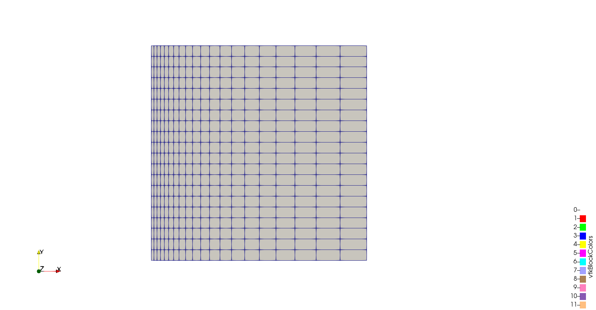
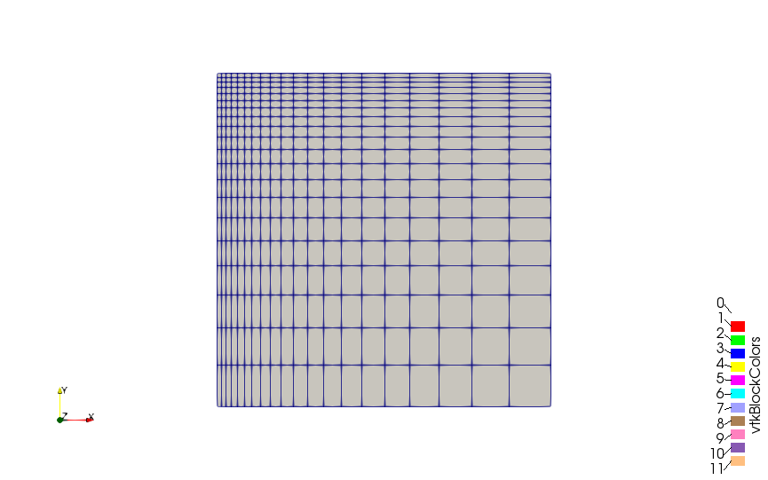

# Creation of Non-Uniform Mesh

A non-uniform but otrhogonal mesh can be created by changing the parameters in `simpleGrading` in `blockMeshDict` to some non zero value.\

The parameters in `simpleGrading` are something known as *Expansion Ratio*. The *Expansion Ratio* is the ratio of width of the end cell to width of the starting cell in a particluar co-ordinate axis.\
This repeated in the other co-odrinate axis provides the non-uniform orthogonal meshing.\
\

  
A helpful website to calculate the expansion ratio for various conditions can be found [here](https://openfoamwiki.net/index.php/Scripts/blockMesh_grading_calculation)\
From this site, exact cell size can be found out, thus giving us the exact expansion ratio to put in `simpleGrading`

## Meshing 

* For expansion ratio of greater than 1,  `siimpleGrading` is set to :  `simpleGrading (10 1 1)` 

* For meshing in both X and Y axis. `siimpleGrading` is set to :  `simpleGrading (10 0.1 1)` 

  
# Multiple Blocking Mesh Generation Approach
Since `simpleGrading` only applies to one block at a time, creation of multiple different meshes is done by making different blocks and then applyinng `simpleGrading` to provide non-linear meshes.\
*Note*: The multiple block approach will throw errors if the cell continuity is not maintained. Meaning that the cell boundaries between the blocks are to be maintained.\
  
  

