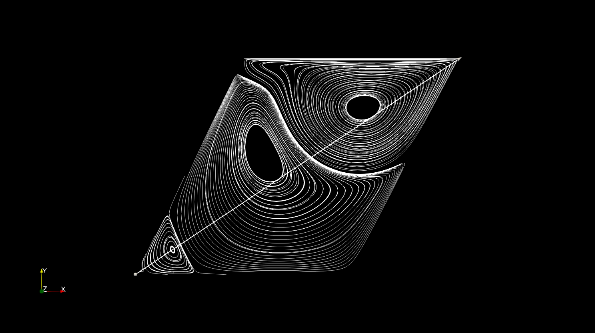
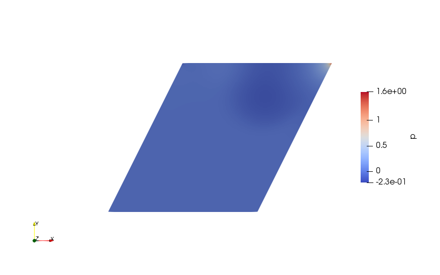

# Results for skew angle of 26.56

The skew angle is set to atan(0.5) or 26.56505 deg
## For Reynold's Number 200

The velocity profile develops as:
  
  
  
The final velocity profile is:  
  
  
  
  
# For Reynolds Number of 1000
The velocity profile develops as:
  
  
  
The final velocity profile is:  
  
\
The streamline plot at the end looks like:
  
  
The final pressure profile develops as:  
  
  
