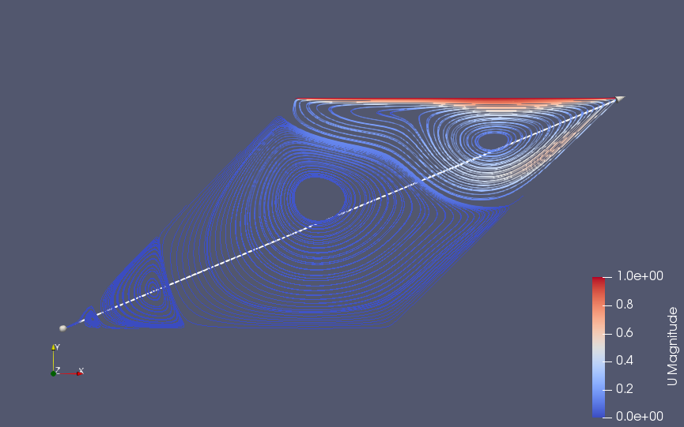

# Results for skew angle of 45

The skew angle is set to 45 deg
## For Reynold's Number 200

The velocity profile develops as:
  
  
  
The final velocity profile is:  
  
  
  
  
# For Reynolds Number of 1000
The velocity profile develops as:
  
  
  
The final velocity profile is:  
  
\
The streamline plot at the end looks like:
  
  
  

