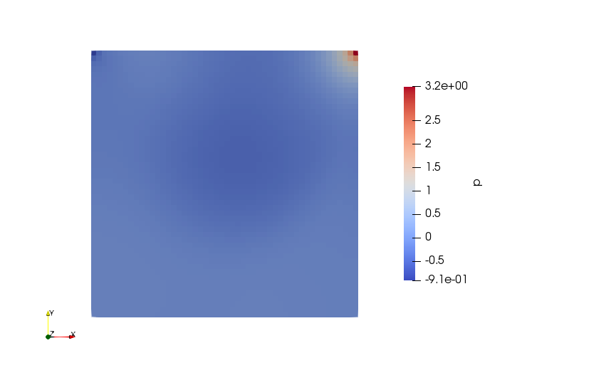
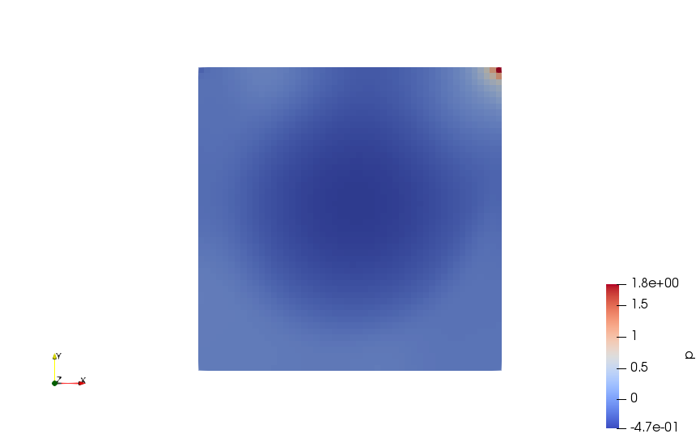

# Steady Flow in a Square Cavity

The velocity profile in the square cavity can be written as:  
  

This is simulated in OpenFoam (v7), with the dimension for the cavity are 1 x 1 m and the lid is driven along positve x with velocity 1 m/s
The cells size is 50*50 and the block is one cell thick.

The commands for this are:

    foamCleanTutorials
    foamCleanPolyMesh

    blockMesh
    checkMesh

    simpleFoam > log.simpleFoam

    paraFoam

# Results
## For Reynolds Number of 200
  
The velocity profile develops as:
  
  
  
The final velocity profile is:  
  
  
  
The final pressure profile develops as:
  
  
  
## For Reynolds Number of 1000
The velocity profile develops as:
  
  
  
The final velocity profile is:  
  
  
  
The final pressure profile develops as:  
  
  
