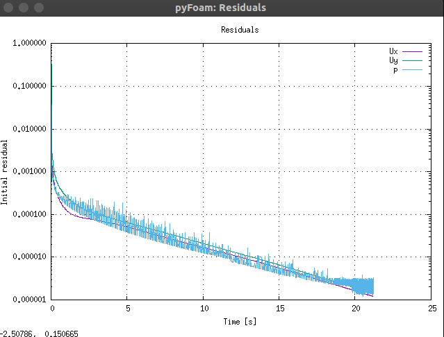
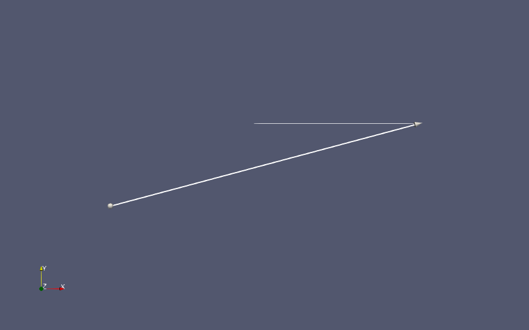
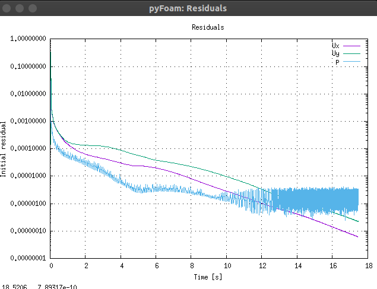
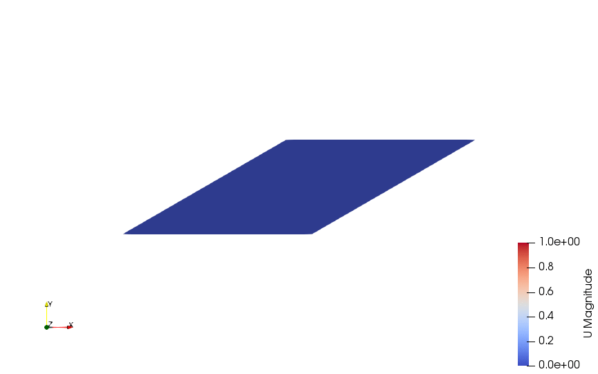
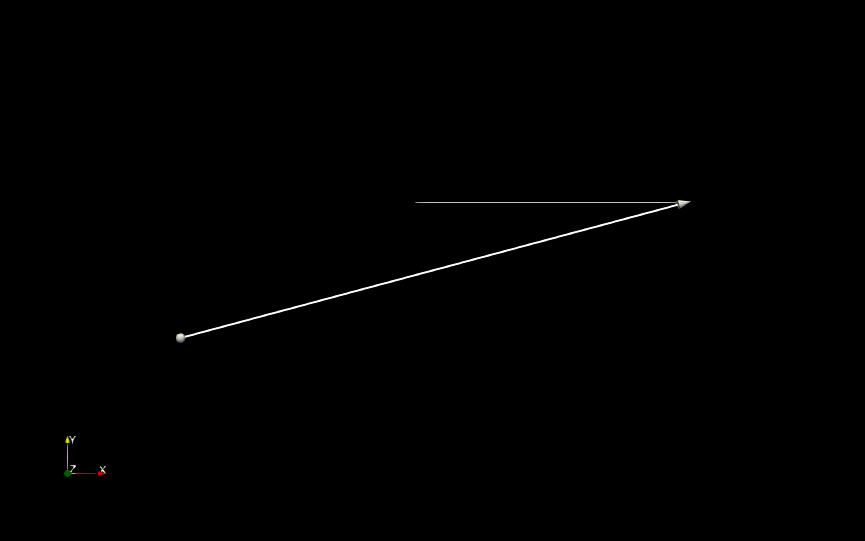

# Unsteady Flow Simulation in Square Cavity 
Lid-Driven Square cavity actually has a steady state solution. So using the unsteady solver in OpenFoam the residual does converge to zero.\
  

For unsteady simulation the solver used is : `icoFoam`.\
icoFoam solves the incompressible laminar Navier-Stokes equations.
This is simulated in OpenFoam (v7), with the dimension for the cavity are 1 x 1 m and the lid is driven along positve x with velocity 1 m/s .\
The mesh created is non-uniform with more cells near the boundary to account for better near wall physics.

# Results
## For Re 400

The Residual Plot plotred by pyFoam is: The residual approaches 1e-6 and the simulation converges.

The velocity profile develops as:

And the strean line plot is as:

## For Re 800

The Residual Plot plotred by pyFoam is: The residual approaches 1e-6 and the simulation converges.

The velocity profile develops as:

And the strean line plot is as:

